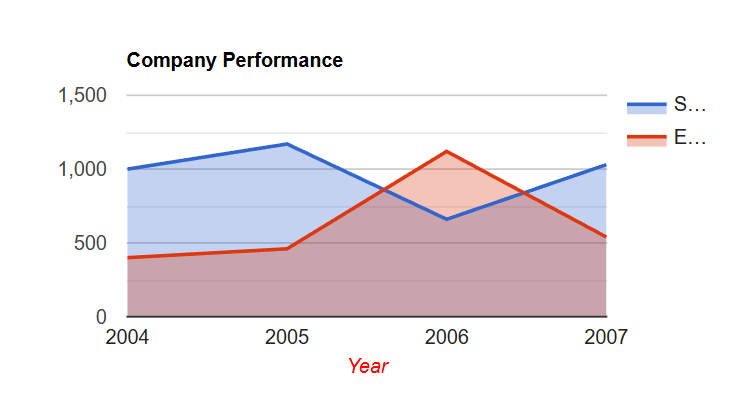

# org.nextframework.jsbuilder

## Overview

Java DSL for generating JavaScript code on the server-side. Unlike STJS which transpiles Java to JavaScript for browser execution, jsbuilder generates JavaScript strings from Java code running on the server. Includes typed wrappers for Google Charts.

```java
// Java (server-side)
DataTable data = new DataTable();
data.addColumn("string", "Year");
data.addRows(new Object[][] {{"2024", 100}});
PieChart chart = new PieChart(document.getElementById("chart"));
chart.draw(data, map("title", "Sales"));
```

```javascript
// Generated JavaScript string
var data_1 = new google.visualization.DataTable();
data_1.addColumn("string", "Year");
data_1.addRows([["2024", 100]]);
var chart_2 = new google.visualization.PieChart(document.getElementById("chart"));
chart_2.draw(data_1, {title: "Sales"});
```

---

## Architecture

```
org.nextframework.jsbuilder/
├── src/
│   └── org/nextframework/view/js/
│       ├── builder/           # Core builder classes
│       │   ├── JavascriptBuilder.java
│       │   ├── JavascriptBuilderContext.java
│       │   ├── JavascriptBuilderArray.java
│       │   ├── JavascriptBuilderMap.java
│       │   ├── JavascriptBuilderFunction.java
│       │   └── JavascriptBuilderObjectReference.java
│       ├── api/               # API interfaces
│       │   ├── Core.java      # Basic types (Obj, Ref, Array, Map, Function)
│       │   └── Html.java      # DOM references (document)
│       ├── JavascriptObject.java
│       ├── JavascriptMap.java
│       ├── JavascriptArray.java
│       ├── JavascriptCode.java
│       └── JSBuilderUtils.java
└── googlevisualization-src/
    └── org/nextframework/view/js/api/
        ├── Google.java              # Google API reference
        └── GoogleVisualization.java # Chart types (PieChart, BarChart, etc.)
```

---

## Core Concepts

### JavascriptBuilder

The base class for building JavaScript code. Extend it and implement the `build()` method:

```java
JavascriptBuilder builder = new JavascriptBuilder() {
    public void build() {
        // Build JavaScript here using the DSL
    }
};

String javascript = builder.toString(); // Get generated JavaScript
```

### Core Types

| Type | Description | JavaScript Output |
|------|-------------|-------------------|
| `Obj` | Object instantiation | `var name = new ClassName(...)` |
| `Ref` | Reference to existing variable | `variableName` |
| `Array` | JavaScript array | `[item1, item2, ...]` |
| `Map` | JavaScript object literal | `{key1: value1, key2: value2}` |
| `Function` | Function definition | `function() { ... }` |

---

## Basic Example

```java
import org.nextframework.view.js.builder.JavascriptBuilder;
import org.nextframework.view.js.api.Core;
import org.nextframework.view.js.api.Html;

public class MyScriptBuilder extends JavascriptBuilder implements Core, Html {

    public void build() {
        // Get DOM element
        Ref container = new Ref(document.getElementById("myDiv").getReference());

        // Set innerHTML
        container.call("innerHTML = ", "Hello World");
    }
}

// Usage
MyScriptBuilder builder = new MyScriptBuilder();
String script = builder.toString();
```

---

## Google Charts Example

The module includes typed wrappers for [Google Visualization API](https://developers.google.com/chart). To use the generated JavaScript, include the Google Charts loader in your page:

```html
<script src="https://www.gstatic.com/charts/loader.js"></script>
```

```java
import org.nextframework.view.js.builder.JavascriptBuilder;
import org.nextframework.view.js.api.*;

public class ChartBuilder extends JavascriptBuilder
        implements Google, Html, GoogleVisualization {

    public void build() {
        // Load Google Charts
        google.load("visualization", "1", map("packages", array("corechart")));

        // Create callback function
        Function drawChart = new Function(new JavascriptBuilder() {
            public void build() {
                // Create data table
                DataTable data = new DataTable();
                data.addColumn("string", "Year");
                data.addColumn("number", "Sales");
                data.addColumn("number", "Expenses");
                data.addRows(new Object[][] {
                    {"2004", 1000, 400},
                    {"2005", 1170, 460},
                    {"2006", 660, 1120},
                    {"2007", 1030, 540}
                });

                // Create and draw chart
                AreaChart chart = new AreaChart(document.getElementById("chart_div"));
                chart.draw(data, map(
                    "width", 400,
                    "height", 200,
                    "title", "Company Performance",
                    "hAxis", map(
                        "title", "Year",
                        "titleTextStyle", map("color", "#FF0000")
                    )
                ));
            }
        });

        google.setOnLoadCallback(drawChart);
    }
}
```

### Generated JavaScript

```javascript
google.load("visualization", "1", {packages: ["corechart"]});
function function_1(){
    var data_2 = new google.visualization.DataTable();
    data_2.addColumn("string", "Year");
    data_2.addColumn("number", "Sales");
    data_2.addColumn("number", "Expenses");
    data_2.addRows([["2004", 1000, 400],
            ["2005", 1170, 460],
            ["2006", 660, 1120],
            ["2007", 1030, 540]]);
    var chart_5 = new google.visualization.AreaChart(document.getElementById("chart_div"));
    chart_5.draw(data_2, {width: 400,
            height: 200,
            title: "Company Performance",
            hAxis: {title: "Year", titleTextStyle: {color: "#FF0000"}}});
}
google.setOnLoadCallback(function_1);
```

### Result



### Using in JSP

```jsp
<%@ page import="com.myapp.ChartBuilder" %>
<%
    ChartBuilder chartBuilder = new ChartBuilder();
    chartBuilder.setChartData(myData); // custom method
%>
<html>
<head>
    <script src="https://www.gstatic.com/charts/loader.js"></script>
</head>
<body>
    <div id="chart_div"></div>
    <script>
        <%= chartBuilder.toString() %>
    </script>
</body>
</html>
```

---

## Available Chart Types

| Class | Google Visualization Type |
|-------|--------------------------|
| `AreaChart` | google.visualization.AreaChart |
| `BarChart` | google.visualization.BarChart |
| `ColumnChart` | google.visualization.ColumnChart |
| `LineChart` | google.visualization.LineChart |
| `CurvedLineChart` | google.visualization.LineChart (with curveType) |
| `PieChart` | google.visualization.PieChart |
| `ScatterChart` | google.visualization.ScatterChart |
| `TableChart` | google.visualization.Table |
| `ComboChart` | google.visualization.ComboChart |

---

## Helper Methods

### map()

Create a JavaScript object literal:

```java
map("key1", "value1", "key2", 123, "key3", true)
// Output: {"key1": "value1", "key2": 123, "key3": true}
```

### array()

Create a JavaScript array:

```java
array("item1", "item2", 123)
// Output: ["item1", "item2", 123]
```

### Nested structures

```java
map(
    "options", map(
        "width", 400,
        "colors", array("red", "blue", "green")
    )
)
// Output: {"options": {"width": 400, "colors": ["red", "blue", "green"]}}
```

---

## Type Conversion

The module automatically converts Java types to JavaScript:

| Java Type | JavaScript Output |
|-----------|-------------------|
| `String` | `"quoted string"` |
| `Integer`, `Long`, etc. | `123` |
| `Boolean` | `true` / `false` |
| `Date`, `Calendar` | `new Date(timestamp)` |
| `null` | `null` |
| `JavascriptReferenciable` | Reference value (unquoted) |

---

## Comparison: jsbuilder vs STJS

| Feature | jsbuilder | STJS |
|---------|-----------|------|
| Execution | Server-side (generates JS strings) | Browser (transpiled Java runs in browser) |
| Use case | Dynamic script generation | Type-safe browser UI code |
| Output | JavaScript string | JavaScript file |
| IDE support | Full Java IDE support | Full Java IDE support |
| Type safety | At generation time | At compile time + runtime |

**When to use jsbuilder:**
- Generating dynamic JavaScript based on server data
- Building Google Charts with data from database
- Creating one-off scripts embedded in pages

**When to use STJS:**
- Writing reusable browser components
- Building interactive UI with event handlers
- Code that needs to run entirely in the browser
