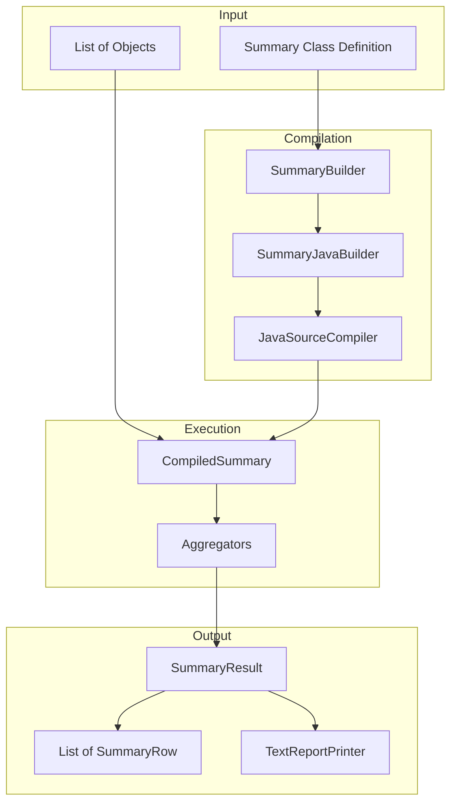
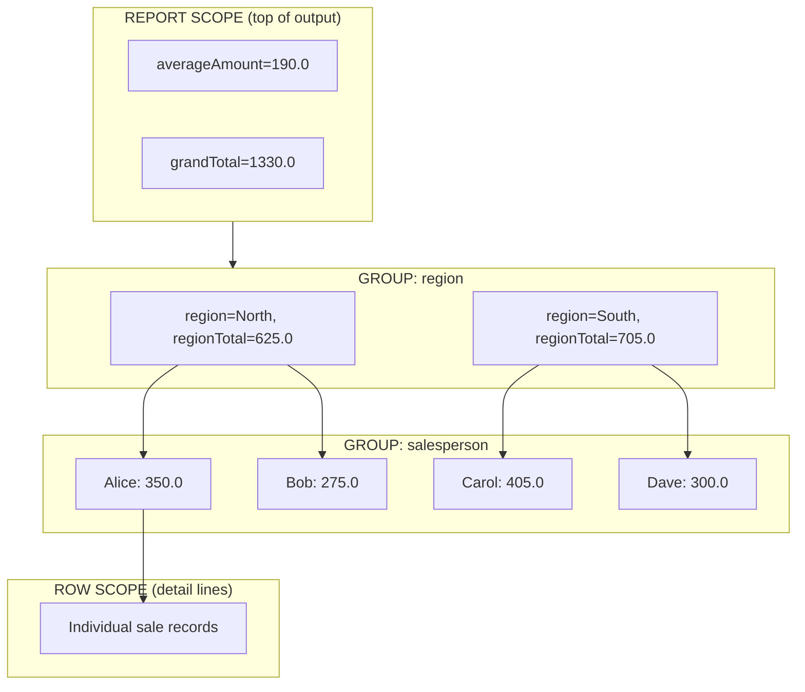

# org.nextframework.summary

## Overview

Data summarization and aggregation framework. Process collections of objects and generate hierarchical reports with grouping and calculated fields, similar to pivot tables or SQL GROUP BY with multiple aggregation levels.

```java
// Input: flat list
[{region:"North", sales:100}, {region:"North", sales:200}, {region:"South", sales:150}]

// Definition
@Group(1) String getRegion() { return getCurrent().getRegion(); }
@Variable(calculation=SUM, scope=GROUP) Double getTotal() { return getCurrent().getSales(); }

// Output: hierarchical report
Region: North  Total: 300
  - North, 100
  - North, 200
Region: South  Total: 150
  - South, 150
```

---

## Architecture



---

## Complete Example: Sales Report

### The Data

```java
public class Sale {
    private String region;
    private String salesperson;
    private String product;
    private Double amount;
    private Integer quantity;

    public Sale(String region, String salesperson, String product,
                Double amount, Integer quantity) {
        this.region = region;
        this.salesperson = salesperson;
        this.product = product;
        this.amount = amount;
        this.quantity = quantity;
    }

    // getters...
    public String getRegion() { return region; }
    public String getSalesperson() { return salesperson; }
    public String getProduct() { return product; }
    public Double getAmount() { return amount; }
    public Integer getQuantity() { return quantity; }

    @Override
    public String toString() {
        return String.format("%-8s %-10s %-10s %8.2f %3d",
            region, salesperson, product, amount, quantity);
    }
}
```

### The Summary Definition

```java
public class SalesSummary extends Summary<Sale> {

    // === GROUPS (define the hierarchy) ===

    @Group(1)  // Outermost group
    public String getRegion() {
        return getCurrent().getRegion();
    }

    @Group(2)  // Inner group
    public String getSalesperson() {
        return getCurrent().getSalesperson();
    }

    // === VARIABLES (calculated values) ===

    // Sum per salesperson (resets when salesperson changes)
    @Variable(calculation = CalculationType.SUM,
              scope = Scope.GROUP, scopeGroup = "salesperson")
    public Double getSalespersonTotal() {
        return getCurrent().getAmount();
    }

    // Sum per region (resets when region changes)
    @Variable(calculation = CalculationType.SUM,
              scope = Scope.GROUP, scopeGroup = "region")
    public Double getRegionTotal() {
        return getCurrent().getAmount();
    }

    // Grand total (never resets)
    @Variable(calculation = CalculationType.SUM, scope = Scope.REPORT)
    public Double getGrandTotal() {
        return getCurrent().getAmount();
    }

    // Count per salesperson
    @Variable(calculation = CalculationType.SUM,
              scope = Scope.GROUP, scopeGroup = "salesperson")
    public Integer getSalespersonCount() {
        return getCurrent().getQuantity();
    }

    // Average sale amount (report-wide)
    @Variable(calculation = CalculationType.AVERAGE, scope = Scope.REPORT)
    public Double getAverageAmount() {
        return getCurrent().getAmount();
    }
}
```

### The Execution

```java
public class SalesReportExample {

    public static void main(String[] args) {
        // Sample sales data
        List<Sale> sales = Arrays.asList(
            new Sale("North", "Alice", "Widget",    150.00, 3),
            new Sale("North", "Alice", "Gadget",    200.00, 2),
            new Sale("North", "Bob",   "Widget",    100.00, 2),
            new Sale("North", "Bob",   "Gizmo",     175.00, 1),
            new Sale("South", "Carol", "Widget",    225.00, 5),
            new Sale("South", "Carol", "Gadget",    180.00, 3),
            new Sale("South", "Dave",  "Gizmo",     300.00, 4)
        );

        // Create the summary
        SummaryResult<Sale, SalesSummary> result =
            SummaryResult.createFrom(sales, SalesSummary.class);

        // Print using TextReportPrinter
        TextReportPrinter.print(result);
    }
}
```

### The Output

```
averageAmount=190.0
grandTotal=1330.0
------------------------------------------------------------------------------------------
   region=North
   regionTotal=625.0
   ---------------------------------------------------------------------------------------
   salesperson=Alice
   salespersonCount=5
   salespersonTotal=350.0
   ---------------------------------------------------------------------------------------
      North    Alice      Widget       150.00   3
      North    Alice      Gadget       200.00   2
   =======================================================================================
   salesperson=Bob
   salespersonCount=3
   salespersonTotal=275.0
   ---------------------------------------------------------------------------------------
      North    Bob        Widget       100.00   2
      North    Bob        Gizmo        175.00   1
   =======================================================================================
   region=South
   regionTotal=705.0
   ---------------------------------------------------------------------------------------
   salesperson=Carol
   salespersonCount=8
   salespersonTotal=405.0
   ---------------------------------------------------------------------------------------
      South    Carol      Widget       225.00   5
      South    Carol      Gadget       180.00   3
   =======================================================================================
   salesperson=Dave
   salespersonCount=4
   salespersonTotal=300.0
   ---------------------------------------------------------------------------------------
      South    Dave       Gizmo        300.00   4
```

---

## Understanding the Output



| Output Section | Scope | When Printed |
|----------------|-------|--------------|
| `grandTotal`, `averageAmount` | REPORT | Once at start |
| `region`, `regionTotal` | GROUP (region) | When region changes |
| `salesperson`, `salespersonTotal` | GROUP (salesperson) | When salesperson changes |
| Detail lines (the Sale objects) | ROW | Every row |

---

## Manual Iteration (Custom Output)

For custom formatting, iterate through results manually:

```java
SummaryResult<Sale, SalesSummary> result =
    SummaryResult.createFrom(sales, SalesSummary.class);

SalesSummary firstSummary = result.getFirstSummary();
System.out.println("=== SALES REPORT ===");
System.out.println("Grand Total: $" + firstSummary.getGrandTotal());
System.out.println("Average Sale: $" + firstSummary.getAverageAmount());
System.out.println();

for (SummaryRow<Sale, SalesSummary> row : result.getItems()) {
    Sale sale = row.getRow();
    SalesSummary summary = row.getSummary();

    // Check for region change (print region header)
    if (row.isGroupChanged("region")) {
        System.out.println("\n>> REGION: " + summary.getRegion());
        System.out.println("   Region Total: $" + summary.getRegionTotal());
    }

    // Check for salesperson change (print salesperson header)
    if (row.isGroupChanged("salesperson")) {
        System.out.println("\n   Salesperson: " + summary.getSalesperson());
        System.out.println("   Sales: $" + summary.getSalespersonTotal() +
                           " (" + summary.getSalespersonCount() + " units)");
    }

    // Print detail line
    System.out.printf("      - %s: $%.2f (%d units)%n",
        sale.getProduct(), sale.getAmount(), sale.getQuantity());
}
```

**Output:**

```
=== SALES REPORT ===
Grand Total: $1330.0
Average Sale: $190.0

>> REGION: North
   Region Total: $625.0

   Salesperson: Alice
   Sales: $350.0 (5 units)
      - Widget: $150.00 (3 units)
      - Gadget: $200.00 (2 units)

   Salesperson: Bob
   Sales: $275.0 (3 units)
      - Widget: $100.00 (2 units)
      - Gizmo: $175.00 (1 units)

>> REGION: South
   Region Total: $705.0

   Salesperson: Carol
   Sales: $405.0 (8 units)
      - Widget: $225.00 (5 units)
      - Gadget: $180.00 (3 units)

   Salesperson: Dave
   Sales: $300.0 (4 units)
      - Gizmo: $300.00 (4 units)
```

---

## Dynamic Summary (Runtime Configuration)

When you don't know the grouping at compile time:

```java
// Build summary at runtime
SummaryResult<Sale, Summary<Sale>> result =
    DynamicSummary.getInstance(Sale.class)
        .addGroup("region")
        .addGroup("salesperson")
        .addSum("amount")              // Creates a SUM variable
        .addVariable("quantity", "", CalculationType.SUM)
        .addCount()                    // Adds row count
        .getSummaryResult(sales);

TextReportPrinter.print(result);
```

---

## Filtering and Reordering

```java
SummaryResult<Sale, SalesSummary> result =
    SummaryResult.createFrom(sales, SalesSummary.class);

// Filter to only North region
SummaryResult<Sale, SalesSummary> northOnly =
    result.filterByGroup("region", "North");

// Filter by row property
SummaryResult<Sale, SalesSummary> widgetsOnly =
    result.filterRows("product", "Widget");

// Reorder by total descending
SummaryResult<Sale, SalesSummary> byTotal =
    result.orderBy("summary.regionTotal desc");

// Get just the group summaries (for a summary table)
List<SummaryRow<Sale, SalesSummary>> regionSummaries =
    result.getSumariesForGroup("region");

for (SummaryRow<Sale, SalesSummary> row : regionSummaries) {
    System.out.println(row.getSummary().getRegion() + ": $" +
                       row.getSummary().getRegionTotal());
}
// Output:
// North: $625.0
// South: $705.0
```

---

## Entry Points

| Method | Purpose |
|--------|---------|
| `SummaryResult.createFrom(list, summaryClass)` | Main entry - process data with a Summary class |
| `SummaryBuilder.compileSummary(summaryClass)` | Get CompiledSummary for reuse |
| `DynamicSummary.getInstance(dataClass)` | Build summary configuration at runtime |
| `TextReportPrinter.print(result)` | Print formatted report to stdout |

---

## Key Classes

| Class | Purpose |
|-------|---------|
| `Summary<E>` | Abstract base class - extend this to define groups and variables |
| `SummaryRow<ROW, SUMMARY>` | Container for one row + its calculated summary |
| `SummaryResult<ROW, SUMMARY>` | Collection wrapper with filtering/ordering |
| `TextReportPrinter` | Utility to print hierarchical report |

---

## Annotations

### @Group

Marks a method as a grouping column.

```java
@Group(value = 1)           // Priority: 1 = outermost
@Group(value = 2, name = "customName")
```

### @Variable

Marks a method as a calculated field.

```java
@Variable(calculation = CalculationType.SUM)
@Variable(calculation = CalculationType.AVERAGE)
@Variable(calculation = CalculationType.MAX)
@Variable(calculation = CalculationType.MIN)
@Variable(calculation = CalculationType.INCREMENT)  // For counting
@Variable(customAggregator = MyAggregator.class)    // Custom logic
```

**Scope options:**

| Scope | Behavior |
|-------|----------|
| `Scope.ROW` | Value from current row only (no aggregation displayed) |
| `Scope.GROUP` | Aggregates within group, resets on group change |
| `Scope.REPORT` | Aggregates entire dataset, never resets |

---

## SummaryRow API

| Method | Returns | Description |
|--------|---------|-------------|
| `getRow()` | E | Original data object |
| `getSummary()` | SUMMARY | Calculated summary object |
| `isFirst()` | boolean | True for first row |
| `getChangedGroups()` | String[] | Names of groups that changed |
| `isGroupChanged(name)` | boolean | Check if specific group changed |
| `getRowIndex()` | int | Position in original list |

